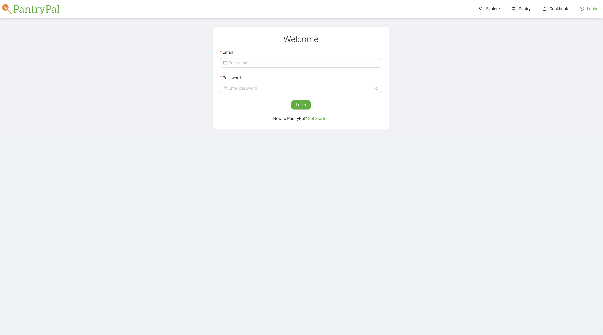
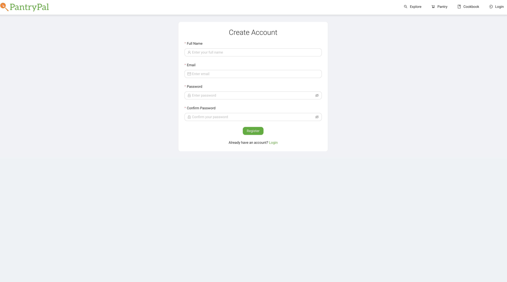
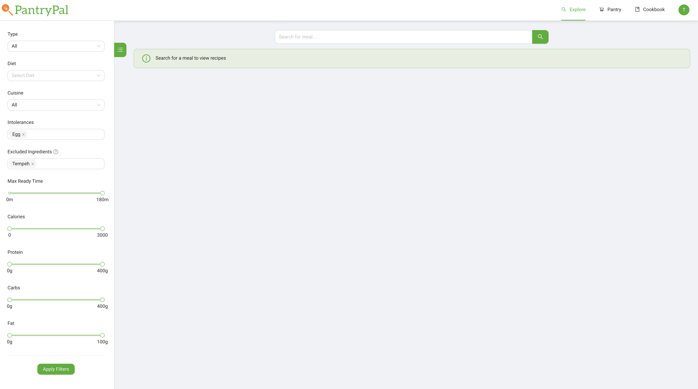
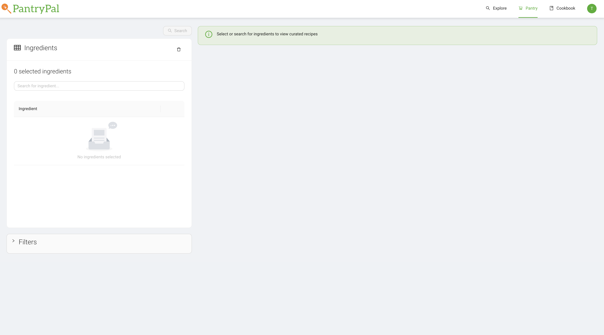
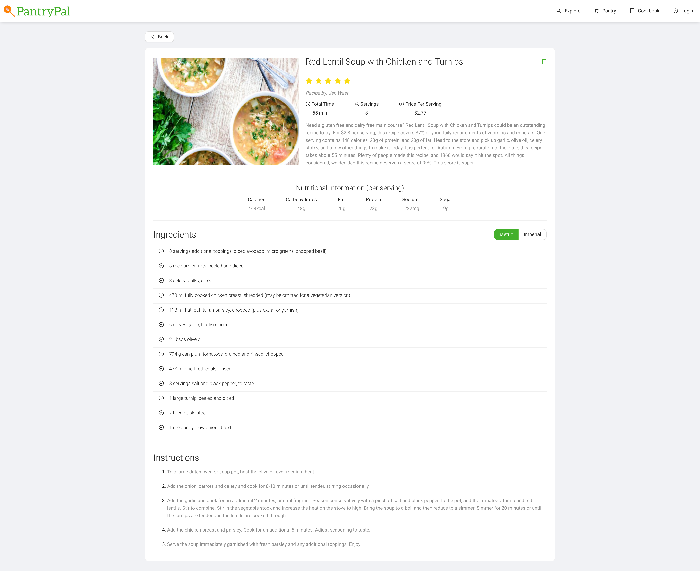
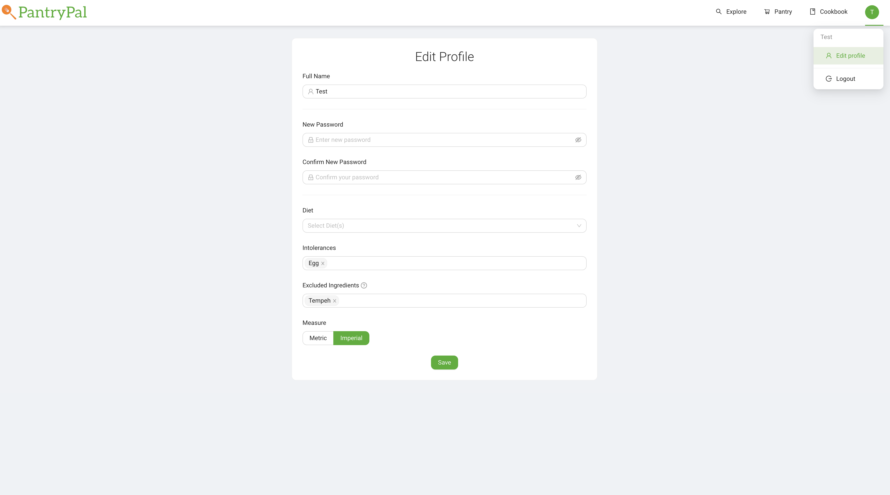

## PantryPal

To view the deployed version of the application, visit: [PantryPal](http://www.pantrypal.ca/login)

## Features

### :spaghetti: Search Dishes

Users can search for a particular dish and PantryPal will return a list of recipes; including their ingredients, nutrition information and cost breakdown.

### :carrot: Add Ingredients

Users can select food items they have on hand to be used for recipe search. These food items are categorized into food-groups to make the process of finding recipes as simple as possible. Recipes will be recommended based on the added ingredients.

### :mag: Customize Search Results

Users can customize their search results using filters to match specific dietary restrictions, and to fit their lifestyles. This can include filtering by diet, food intolerances, and lifestyle restrictions such as cooking time, calories, macros, and more.

### :notebook_with_decorative_cover: Save Recipes

Users can save recipes to their “Cookbook”. This gives users quick and direct access to their favourite recipes.

## Screenshot of Available Features

### Login

- Login to existing account or be redirected to register page

### Register

- Prompts user to create a new account or redirects them to the login page

### Explore

- Explore new recipes by searching for a particular meal
- Use filters to refine search results to fit dietary needs and preferences

## Pantry

- Explore new recipes by listing available ingredients
- Ingredients can be selected using the list view with tags, or in the table layout with a search bar
- Use filters to refine search results to fit dietary needs and preferences

### Cookbook

- View cookbook of saved recipes

### Recipe Details

- View additional recipe details including a summary, ingredients in a specified measurement, and the steps

### Edit Profile

- Edit profile if logged in
- Features of having an account:
  - Ability to saved recipes to cookbook
  - Create a profile with dietary restrictions, intolerances, excluded ingredients and preferred unit of measurement so these fields do not have to be modified every time
